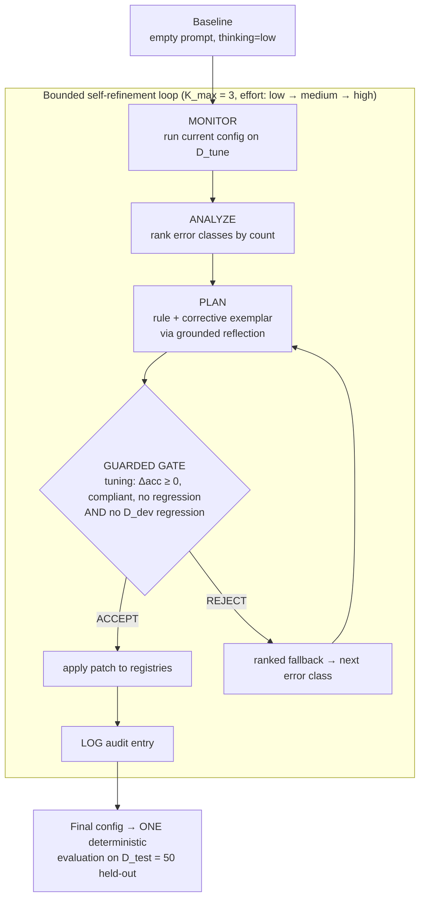

# financial_data_analyst_agent — Self-Improving Financial-QA Agent

> A financial-QA agent that improves itself over **3 cycles without retraining** — changing only its **prompt** (rules + exemplars mined from its own mistakes) and the model's **`thinking_level`** — where every change must pass a **validation-guarded governance gate** before it is accepted, and every decision is logged for auditability.

<p align="left">
  
  
  
  
  
</p>

Bounded self-refinement — *not* recursive self-improvement, *not* fine-tuning. Code comments are in Greek.

---

## TL;DR

An LLM agent answers questions from **FinQA** (numerical reasoning over financial filings). After a baseline pass it enters a bounded loop: it **monitors** its errors, **analyzes** the dominant failure class, **plans** a fix (a natural-language rule + a corrective exemplar), and applies it only if a **governance gate** confirms the fix helps on the tuning set **and does not regress an independent validation set** — otherwise it falls back to the next error class. The result is self-improvement that is verified to generalize at every step, with a complete audit trail.

| D_test (50 held-out) | baseline (empty prompt, low) | final config (3 rules, high) |
|---|---|---|
| **execution accuracy** | 0.74 (37/50) | **0.76 (38/50) ▲** |
| **program accuracy** | 0.20 | **0.42 ▲** |

*Single deterministic run (`seed=42`, `temperature=0`), `gemini-3.6-flash`. D_dev trajectory across the 3 accepted patches: 0.633 → 0.667 → 0.700 → 0.700.*

---

## Why the guard matters

Self-improvement measured only on the tuning distribution can **silently overfit**: a rule that raises tuning accuracy can quietly hurt unseen data. This agent guards against that by validating every candidate patch on an **independent `D_dev` slice** before accepting it, and by trying the **next** error class when a patch is rejected.

The published run shows the mechanism working. In loop 1 the greedy top error class was `wrong_operation`, and its candidate rule **raised tuning accuracy (+0.10) but collapsed `D_dev` (0.633 → 0.300, −0.33)** — a classic overfit. The guard **rejected** it and the ranked fallback moved to `scale_unit`, whose rule improved **both** tuning (+0.15) and `D_dev` (+0.03). Every rule the agent finally kept improved tuning *and* held-out validation:

| Loop | effort | accepted rule (class) | tuning Δacc | D_dev |
|---|---|---|---|---|
| 1 | low | `scale_unit` (rank #2, after `wrong_operation` was blocked) | +0.15 | 0.633 → 0.667 |
| 2 | medium | `sign_error` (rank #3) | +0.05 | 0.667 → 0.700 |
| 3 | high | `hallucinated_constant` (rank #1) | +0.10 | 0.667 → 0.700 |

On held-out `D_test`, `scale_unit` errors dropped for the first time (7 → 6) and `wrong_cell` cleared (1 → 0).

---

## Architecture



**Action space (the only things the loop may change):**
- **(a) Prompt** — a registry of learned `rules` + a bank of corrective `exemplars`.
- **(b) `thinking_level`** — the model's official reasoning-budget parameter, scheduled `low → medium → high`, one level per loop.

Everything else (model, temperature, retrieval, decomposition, tools) is **locked**, so any accuracy change is attributable to those two levers. The gate scans every patch for out-of-space keywords (`temperature`, `retrieval`, `fine-tune`, `change model`, …) and rejects non-compliant ones.

---

## How the guarded gate decides

A candidate patch is **ACCEPT**ed only if **all** of these hold:

1. **Gain** — `Δaccuracy ≥ 0` on `D_tune`,
2. **Compliance** — the patch text stays inside the locked action space,
3. **Program-equivalence** — it does not turn any previously-correct instance wrong,
4. **Held-out safety** — it does **not** regress execution accuracy on the independent `D_dev` slice.

If any fails, the patch is rejected and the loop tries the next error class in rank order. Every decision — including every rejected attempt and its `D_dev` delta — is written to `gate_log.json`.

---

## Experimental design

| Split | Size | Role |
|---|---|---|
| **D_tune** | 20 | drives the loop; a calibration-representative selection over the general FinQA error distribution |
| **D_dev** | 30 | independent guard; a patch must not regress it |
| **D_test** | 50 | held-out; **one** final deterministic evaluation |

- **Stratification:** `D_test` is balanced across 6 cells = source `{table, text}` × complexity `{1-step, 2-step, 3+-step}`, for clean per-cell error analysis.
- **Metrics:** *execution accuracy* (numeric match, 1% tolerance) and *program accuracy* (arithmetic-structure match).
- **Reproducibility:** `seed=42`, `temperature=0`, single deterministic run; every call is retried with backoff and every instance is checkpointed (`--resume`).

---

## Repository layout

```
financial_data_analyst_agent/
├── config.py                # locked constants (model, levels, K_max, seeds, gate thresholds, retry)
├── run.py                   # orchestrator: guarded self-refinement → D_test before/after
├── build_calib_pool.py      # calibration pool over the train split (general error distribution)
├── build_tune_calibrated.py # representative D_tune selection from that distribution
├── build_dev_slice.py       # independent D_dev slice (stratified, disjoint from tune/test)
├── prompts/
│   ├── base_prompt.txt         # fixed system prompt (FINAL_ANSWER contract)
│   ├── guidance_rules.yaml      # learned rules registry  (lever a)
│   └── exemplar_bank.json       # corrective exemplars     (lever a)
├── src/
│   ├── dataset.py           # FinQA download + 6-cell stratified sampling
│   ├── agent.py             # prompt composition + answer
│   ├── genai_client.py      # Gemini client with backoff/jitter on 429/500/503/504
│   ├── error_taxonomy.py    # 7-class deterministic error classifier (+ optional LLM judge)
│   ├── metrics.py           # execution accuracy (1% tol) + program accuracy
│   ├── planner.py           # PLAN step: grounded reflection → rule + exemplar (ranked)
│   ├── gate.py              # guarded governance gate (tuning + D_dev no-regression)
│   ├── loop.py              # the Monitor→Analyze→Plan→Gate→Log loop with ranked fallback
│   └── logging_util.py      # per-run audit trail
├── data/sample/             # d_calib, d_tune (representative), d_dev, d_test
└── results/                 # the published run: report.md, summary.json, gate_log.json, final rules & exemplars
```

`results/gate_log.json` is the full audit trail: every loop, every attempted error class, the tuning delta and the `D_dev` delta, and the accept/reject reason.

---

## Quickstart

```bash
pip install -r requirements.txt
cp .env.example .env          # then add your GEMINI_API_KEY
```

```bash
python -m src.dataset         # 1. (once) download FinQA + build the stratified samples
python build_calib_pool.py    # 2. build the calibration pool (general error distribution)
python build_tune_calibrated.py  # 3. select the representative D_tune (20)
python build_dev_slice.py     # 4. build the independent D_dev slice (30)
python run.py --mock          # 5. end-to-end pipeline check WITHOUT the API (free, seconds)
python run.py                 # 6. full run: guarded self-refinement + D_test evaluation
```

Useful flags: `--limit N` (smoke test on N instances), `--no-llm-plan` (rules from deterministic templates), `--judge llm` (LLM-as-judge error classification), `--tag <name>`, `--model <id>`, `--resume <run_id>`. Results are written to `results/runs/<timestamp>/` (`report.md`, `summary.json`, `gate_log.json`).

> **Runtime & resilience:** each call is ~25–100 s (large FinQA contexts + thinking + occasional 503s). A full run takes tens of minutes to hours depending on API load; the client backs off on 429/500/503/504 and transport errors, retries the instance on exhaustion, and checkpoints `D_test` per instance so `--resume` continues a partial run without breaking it.

---

## Limitations

- **Single-run, n=50.** A +1-instance swing on `D_test` is within run-to-run noise; the robust signal is the audit-verified behavior of the guard (it provably blocked an overfit rule: tuning +0.10 / `D_dev` −0.33) and the consistent `D_dev` improvement across accepted patches.
- **`D_dev` is itself small (n=30)** and noisy, but clean enough to catch a −0.33 regression.
- **Program accuracy is a proxy** for the official FinQA program match (normalized operation/operand sequence).

---

## License

Released under the [MIT License](LICENSE).
